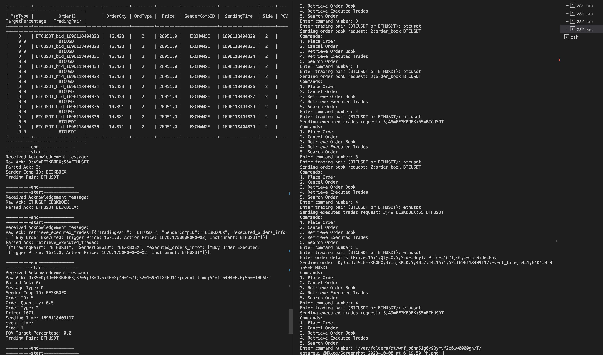
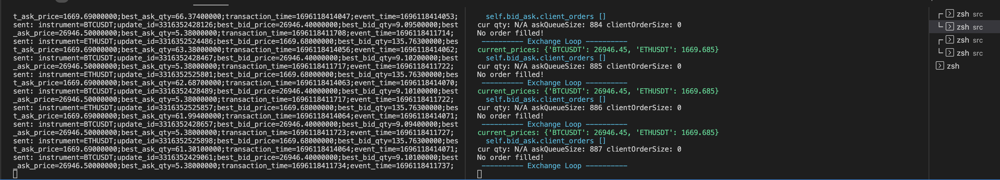

## Installation

Poetry supports multiple installation methods, including a simple script found at [[install.python-poetry.org]](https://python-poetry.org/docs/). For full
installation instructions, including advanced usage of the script, alternate install methods, and CI best practices, see
the full [[installation documentation]](https://python-poetry.org/docs/).

## requirements
    python = "^3.10"
    pyzmq = "^25.1.1"
    tabulate = "^0.9.0"

### data
    src>data>
    https://www.binance.com/en/landing/data
    Book Ticker > BTCUSDT and ETHUSDT

### use
    > poetry install
    > poetry run python market_data_streamer.py data/BTCUSDT-bookTicker.csv data/ETHUSDT-bookTicker.csv
    > poetry run python exchange.py  
    > poetry run python client.py
    > poetry run python ack.py

### image

